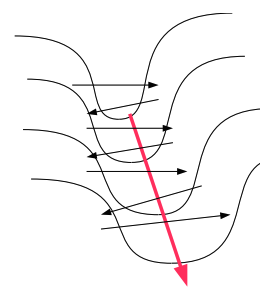

+++
title = 'Weight Normalization: A Simple Reparameterization to Accelerate Training of Deep Neural Networks'
date = 2024-02-19T11:23:55+09:00
draft = true
math = true
tags = []
categories = []
toc = true
+++

## 論文情報

- [Weight Normalization: A Simple Reparameterization to Accelerate Training of Deep Neural Networks](https://arxiv.org/pdf/1602.07868.pdf)
- 2016

## Introduction

ニューラルネットワークは様々な領域で成功を収めているのですが、パラメータの最適化に使用する情報は1次の微分情報（first-oder gradient）です。1次微分は目的関数の形状に依存しているため、"pathological curvature" と呼ばれる問題に直面することもあります。[Deep learning via Hessian-free optimization](https://www.cs.toronto.edu/~jmartens/docs/Deep_HessianFree.pdf) で説明がされていますが、pathological curvature とは、目的関数が細長い谷を持っているような状況を指します。

## Weight normalization

本論文では、weight normalization と呼ばれるニューラルネットワークの最適化手法を導入しています。単純なニューラルネットワークを考えてみます：

$$
y = \phi (w \cdot x + b)
$$

$w$ が $k$ 次元の重み、$x$ が入力ベクトル、$b$ がバイアスであるとして、$\phi$ が非線形関数であるとします。このときに以下のように重みベクトルを分解してみます。

$$
w = g \frac{v}{||v||}
$$

$g$ はスカラー値、$v/||v||$ は正規化されたベクトルを表しています。つまり重みベクトル $w$ を大きさ $g$ とその方向 $v/||v||$ に分解したこととなります。本論文ではこの分解により、$g, v$ を学習対象とすることでSGD 最適化手法の収束速度が速まったと報告しています。

### Gradients

損失関数を $L$ としたときに、$g, v$ それぞれに対する勾配は

$$
\nabla_g L = \frac{\partial L(w)}{\partial g} = \frac{\partial L(w)}{\partial w}\frac{\partial w}{\partial g}  = \nabla_w L \cdot \frac{v}{||v||}
$$

$$
\begin{aligned}
\nabla_v L = \frac{\partial L(w)}{\partial v} 
&= \frac{\partial L(w)}{\partial w}\frac{\partial w}{\partial v}\\\
&= \nabla_w L \cdot \left\\{ \frac{g||v|| - v}{||v||^2}\right\\} 
\end{aligned}
$$

であり、これらに従って学習を進めていくことになります。

また、