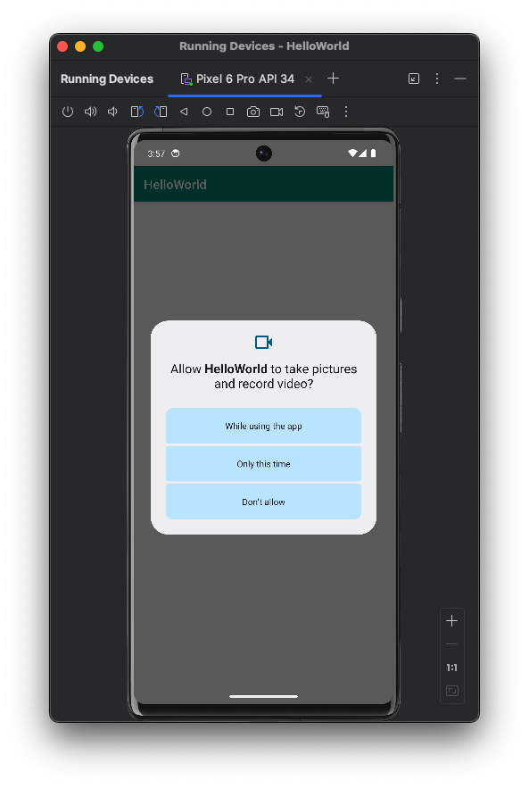

+++
title = 'Hello World! on Android'
date = 2024-04-14T11:51:35+09:00
draft = true
math = true
categories = ["Android"]
tags = []
toc = true
+++


MediaPipe 公式ページの [Hello World! on Android](https://developers.google.com/mediapipe/framework/getting_started/hello_world_android.md) のチュートリアルをやってみようと思います。このチュートリアルでは簡単なカメラ機能を使ったアプリを作成する流れになっています。


## 作業環境


### Android Studio

以下のバージョンの Android Studio を使用しています。



今回は Empty Views Activity を利用してアプリケーションの作成を行ってみます。




### ビルド

公式チュートリアルでは [Bazel](https://bazel.build/) を使用しているのですが、Android Studio でデフォルトで Gradle が使用されていたので Gradle を用いてビルドします[^1]。そのため、チュートリアルでは説明されていないいくつかの手順が必要となります。


## アプリケーション作成

では早速アプリケーションの開発に移ります。


### スタイル

アプリケーションの見た目（スタイル）を編集します。`res/values/` 以下に

- `styles.xml`
- `colors.xml`

を作成します。`colors.xml` は既に存在していると思いますが、`styles.xml`は新規作成して下さい。`styles.xml` ではスタイル（どこをどんな色にするか etc）を定義し、`colors.xml` では実際の値を記入します。

- res/values/styles.xml
  - ここで定義している `style name="..."` の名前は任意です。後でこの名前を参照することで設定を読み込みます




- res/values/colors.xml




以上２ファイルの作成・編集が終わったところで、`AndroidManifest.xml` を修正します。先程定義したスタイル名を参照することで設定を反映します。





### MediaPipe の使用


今回は MediaPipe の [PermissionHelper](https://github.com/google/mediapipe/blob/master/mediapipe/java/com/google/mediapipe/components/PermissionHelper.java) というコンポーネントを利用します。MediaPipe は外部ライブラリであるため何らかの方法でローカルにインストールする必要があるのですが、その際に Gradle の sync 機能を利用します。Gradle はビルドだけではなくパッケージ管理ツールとしての機能も持っていて、適切な設定を行うことで自動的にパッケージ（jar ファイル）をダウンロードしてきてくれます。

ここでは以下のファイルを修正します

- `build.gradle.kts` (Module:app と表示されている方を使用します)
- `libs.versions.toml` 

まず `libs.versions.toml` に

```java
[versions]
...
mediapipe = "latest.release"

[libraries]
...
mediapipe-solution-core = { module = "com.google.mediapipe:solution-core", version.ref = "mediapipe"}
```

を付け足します。次に `build.gradle.kts` に

```java
dependencies {
    ...
    implementation(libs.mediapipe.solution.core)
}
```

を付け足します。Gradle 7.2 から Version Catalog という機能が加わり、`libs.versions.toml` でバージョン管理を一括して行い、`build.gradle.kts` では使用するかどうかの宣言だけを行います。このあとに右上の象のマークを押すと、設定に従って外部ライブラリをインストールしてきてくれます。




まだ理解しきれていないのですが Gradle が参照するリポジトリも複数あるようで、特に指定がなければ MediaPipe の場合には



- https://dl.google.com/dl/android/maven2/com/google/mediapipe/solution-core/maven-metadata.xml

のような Maven リポジトリを参照して必要なファイル（*.pom, *.aar, *.jar）をダウンロードしてきてくれるようです。また [https://mvnrepository.com/artifact/com.google.mediapipe](https://mvnrepository.com/artifact/com.google.mediapipe) では、MediaPipe が用意しているライブラリを一覧することができます[^2]。


### CameraX を使用する

アプリからカメラ機能にアクセスするためにはパーミッション付与が必要となりますが、今回は前述の通り MediaPipe の [PermissionHelper](https://github.com/google/mediapipe/blob/master/mediapipe/java/com/google/mediapipe/components/PermissionHelper.java) を使用します。





[^1]: [Bazel もビルドツールの一つで調べてみると色々と考え方によって選択すればよいらしいです。[LINEはなぜBazelを使わないことにしたのか？](https://engineering.linecorp.com/ja/blog/line-bazel) の記事では Bazel から Xcodebuild に戻したという経緯があるようです（iOSの話ですが...）。]。
[^2]: 必要なリポジトリから libs.version.toml に書くべき内容をどのように逆引きするのかはまだよくわかっていないです...。