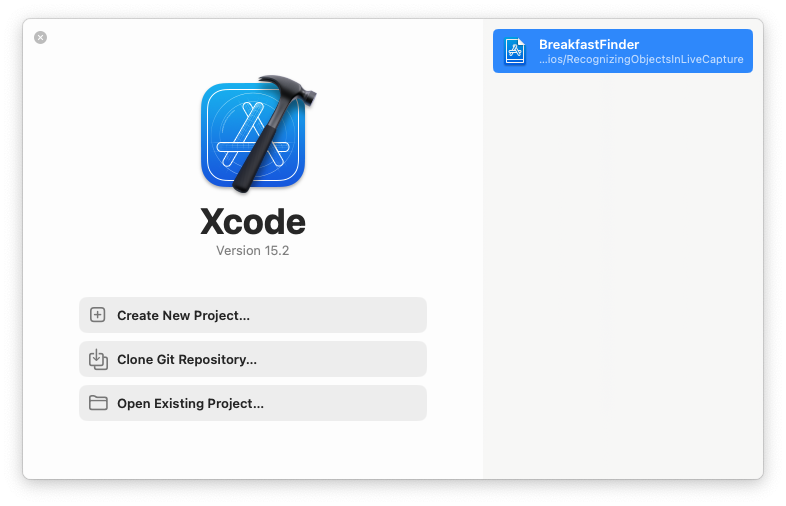
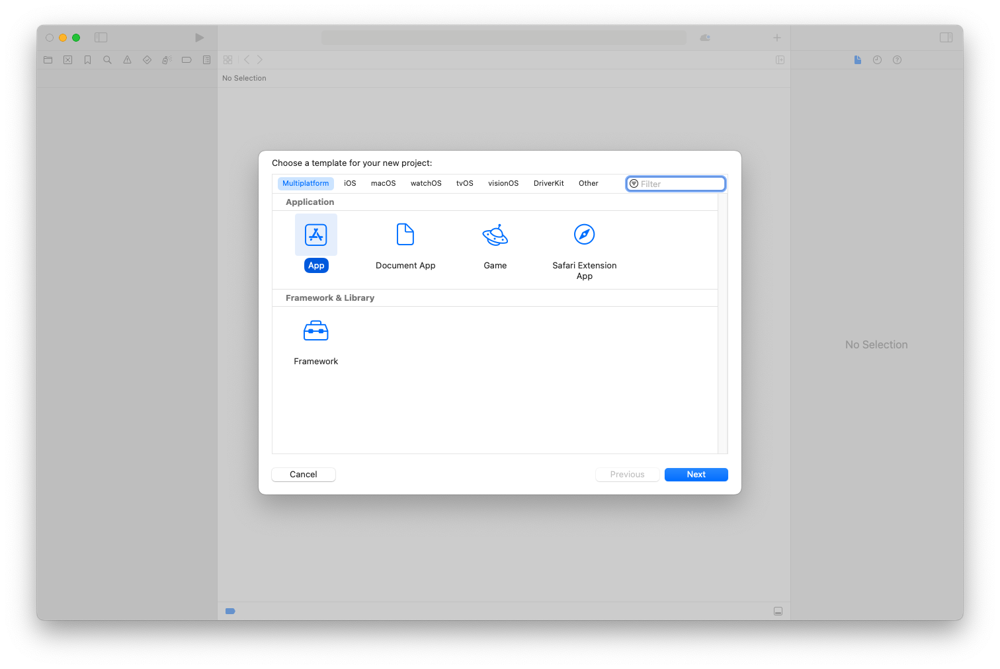
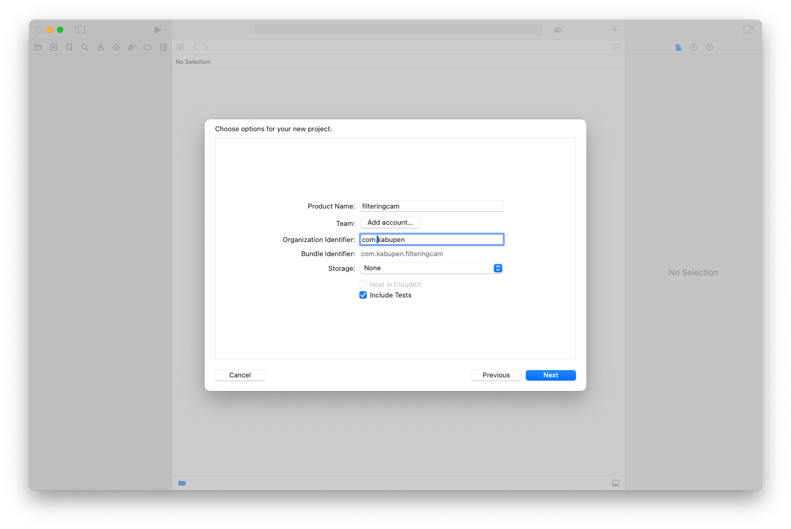
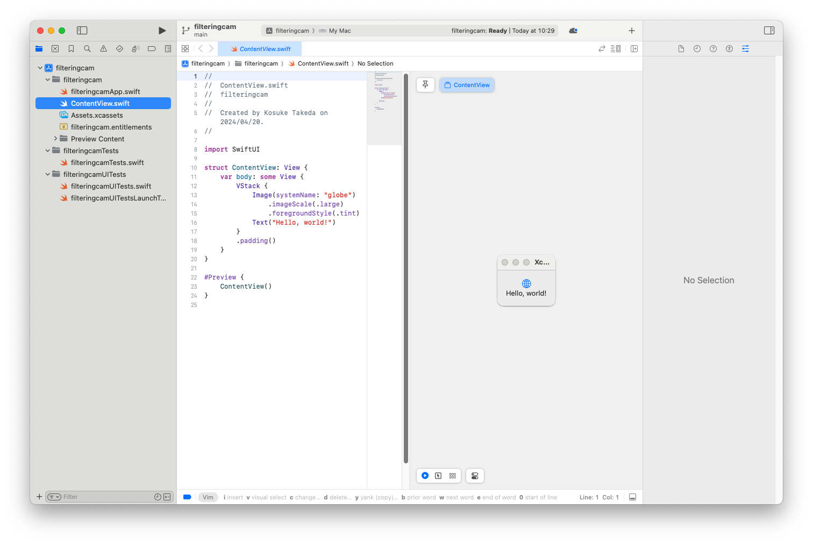
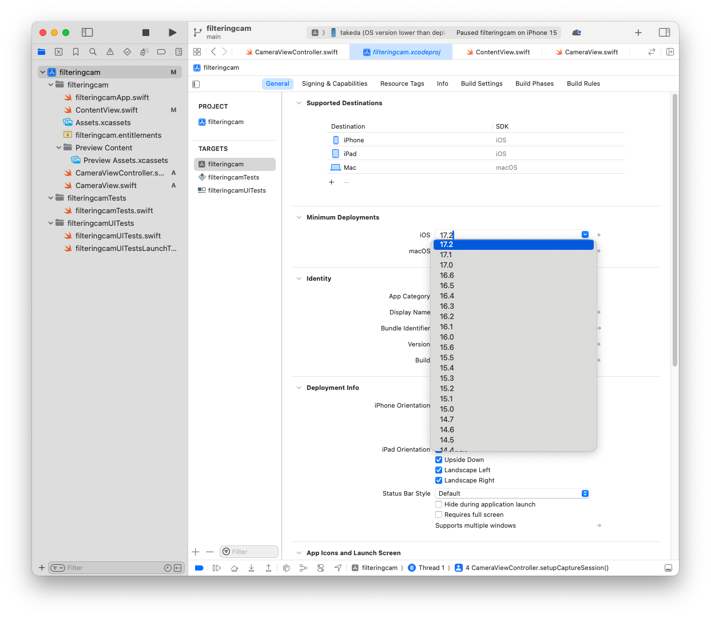

+++
title = 'CoreML の YOLOv3 を動かしてみる'
date = 2024-04-20T10:07:20+09:00
draft = true
math = true
categories = []
tags = []
toc = true
+++

iOS/macOS におけるプログラミングを学びながら CoreML までも学んでみようという、二兎追うものは...を地で行くブログです。

###

https://developer.apple.com/jp/machine-learning/models/

まずは Finder から xcodeproj（Project）ファイルを開きます（もしくは XCode の Fire/Open から選択します）。



iphone と接続
持っている iphone が iOS 16.5.1 だったので、iOS 17 用にビルドしていた環境のままではだめでした
iOS の最小要件を変更しておく必要があります

また iPhone は設定／プライバシーとセキュリティーから「デベロッパーモード」を on にしておく必要があります。

### Info.plist

