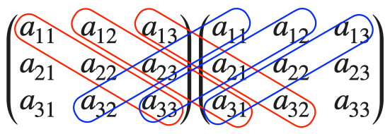

+++
title = '行列の特性'
date = 2024-10-20T15:15:21+09:00
draft = false
categories = []
tags = ["統計"]
+++

### 行列の種類

- 正方行列：$n\times n$ 行列
- 正則行列：$XA=AX=I$ となる逆行列が存在すること

### 逆行列

$n\times n$ 行列の逆行列はガウス・ジョルダン法（掃出し法）で求めることができます。逆行列を求めたい 行列 $A$ に対して
$$
(A|I)
$$
の拡大行列を考え、行基本変形を行うことで
$$
(I|B)
$$
としたときに、行列 $B$ が求めたい逆行列となる方法。

### 行列式

$3\times 3$ 行列の行列式は、サラスの公式として計算方法が知られています。
$$
|A| = a_{11}a_{22}a_{33} + a_{12}a_{23}a_{31} + a_{13}a_{21}a_{32} - a_{11}a_{23}a_{32} - a_{12}a_{21}a_{33} - a_{13}a_{22}a_{31} 
$$
行列式を求めたい行列を2個並べて、以下のように赤括弧の項にはプラス、青括弧の項にはマイナスをつけて計6項足し合わせると、サラスの公式を再現することができます。
